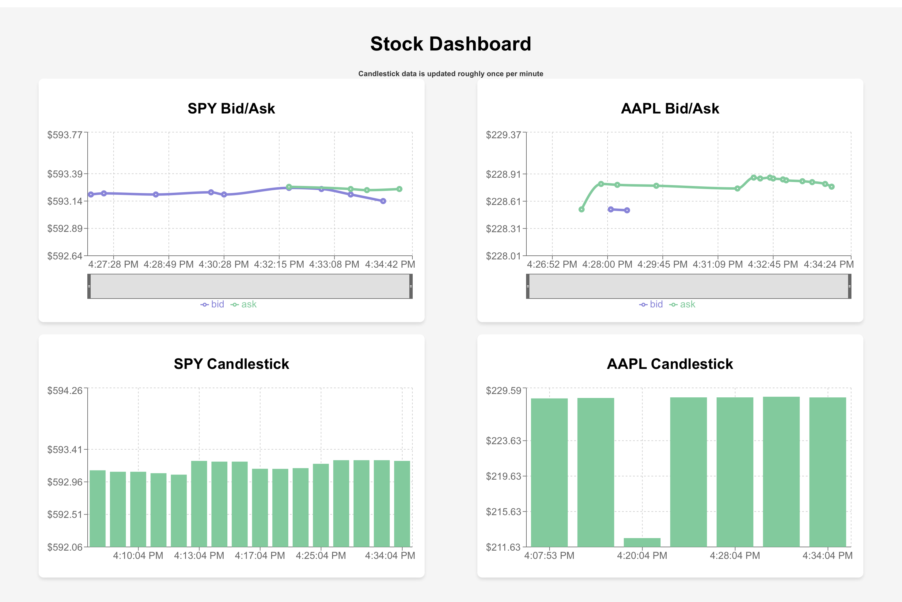
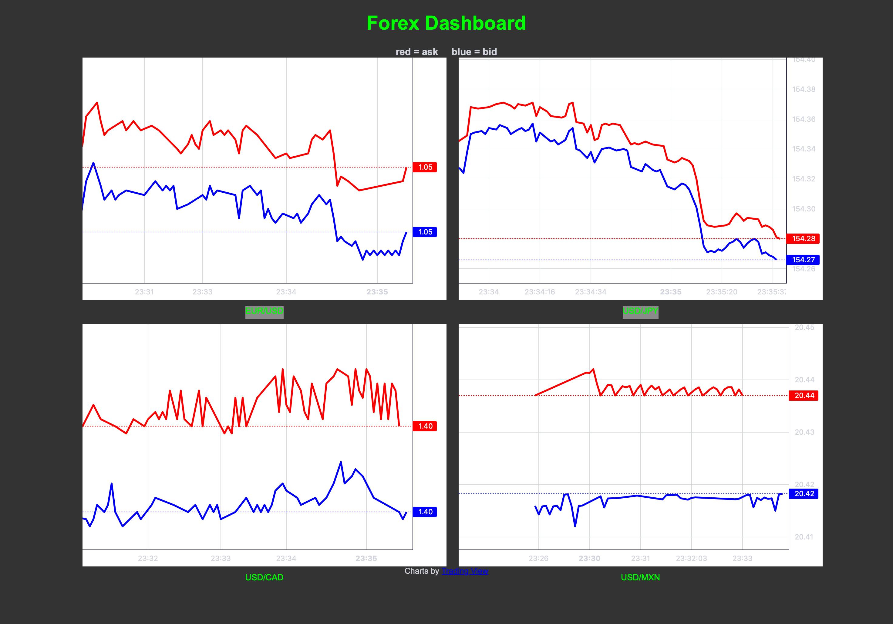

# schwab-client-js

## A modern wrapper around the Schwab financial API for Typescript and Javascript projects

[](https://paypal.me/jlevittpay?country.x=US&locale.x=en_US) [](https://venmo.com/JasonLevitt) [](https://opensource.org/license/mit)   [](https://www.npmjs.com/package/schwab-client-js)

Disclaimer: This project is not affiliated with, endorsed by, or associated with The Charles Schwab Corporation. All registered trademarks are the property of their respective owners. Use of these names, logos, and brands is for identification purposes only. This project is licensed under the MIT license, and acts in accordance with Schwab's API terms and conditions.

<hr style="border: 2px solid black;">

<span>
<figure>
     
</figure>
&nbsp;&nbsp;
<figure>
     
</figure>
</span>
<br />

**Two Streaming Dashboards From The Examples Directory**

### **schwab-client-js** gives you complete access to the Schwab REST API using convenient classes and methods. You can stream real-time market data, create and track orders, and retrieve information about your account as well as retrieve different types of market data.

### Note: This project only supports [nodejs](https://nodejs.org/). Although technically you could tweak schwab-client-js to run in a web browser, security concerns make that a poor choice.

## Installation

**Software prerequisites: nodejs version 18 or newer and a nodejs package manager such as yarn or npm**

**Install the package:**

```
npm install schwab-client-js

or

yarn add schwab-client-js
```

## Schwab Prerequisites

1. You need a [Schwab brokerage account](https://www.schwab.com). Even if you're not executing any
   stock or other trades with the API, you still need to be able to login to your Schwab account in
   order to create an API access token. <br />
   ▪ Login to your Schwab account and [turn on thinkorswim](https://client.schwab.com/app/trade/tradingtools).
   If thinkorswim is already enabled, you won't see instructions on how to enable it. <br />

2. You need to signup for a [Schwab developer account](https://developer.schwab.com). The account is free. <br />
   ▪ Login to your developer account and [create an "app"](https://developer.schwab.com/dashboard/apps) which is really just a web page where you configure the metadata for your API calls. <br />
   ▪ Create a new app and where it says "Select an API product" add both: "Accounts and Trading Production" and "Market Data Production". <br />
   ▪ Use a callback url like `https://127.0.0.1:5556`. Port numbers below 1024 require superuser privileges to "listen" on most systems, so choose a port number above 1024. You can specify up to three callback URLs. <br />
   ▪ You may have to wait a day or two for Schwab to approve your app. You cannot do anything while the status of your app is **Approved - Pending**. When the status of your app is **Ready For Use**, you can proceed. <br />
   ▪ Once your app is approved, go to the [apps section](https://developer.schwab.com/dashboard/apps) and click on **View Details** for your app. At the bottom you should see your **App Key** and **Secret**. <br />

## Configuring the package

**Schwab uses three-legged OAuth** for authentication. The details are on [developer.schwab.com here](https://developer.schwab.com/user-guides/get-started/authenticate-with-oauth) and [here](https://developer.schwab.com/products/trader-api--individual/details/documentation/Retail%20Trader%20API%20Production).

1. Create a `.env` file at the root of your project and add the App Key and Secret from developer.schwab.com. Also add your callback URL to your .env file like this:

```
SCHWAB_CALLBACK_URL=https://127.0.0.1:5556
SCHWAB_APP_KEY=xxxxxxxxxxxxxxxxxxxxxxxxxxxxx
SCHWAB_SECRET=zzzzzzzzzzzzzzzzzzzzzzzzzzzzzzzzzzzzzzzzzzzzzzzzzzzzzzzzzzzzzzz
```

2. Run `schwab-authorize` . After installing schwab-client-js, you should run the helper app named `schwab-authorize`. On MacOS and Linux, you should be able to run it from the command line when you're at the root of your project by typing `schwab-authorize` (for Windows, see Note1 below). It will construct a special Schwab login URL using your SCHWAB_APP_KEY and will try to open your desktop web browser at that URL. You will need to login with your schwab.com credentials (NOT your developer.schwab.com credentials). When you get to the final step, **your browser will likely give you a warning** because `schwab-authorize` dynamically generates a self-signed SSL certificate in order to retrieve the returned HTTPS URL. Allow `schwab-authorize` to access the certificate and it will add the resulting SCHWAB_REFRESH_TOKEN to your .env file. <br />
   ▪ Note1: On Windows, you may have to run it directly:  
    `C:\> node node_modules/schwab-client-js/bin/schwab-authorize.js` <br />
   ▪ Note2: Schwab only lets you have one SCHWAB_REFRESH_TOKEN working per Schwab login. So, if you have multiple projects using schwab-client-js, you'll need to use the same SCHWAB_REFRESH_TOKEN for all of them. Creating a new SCHWAB_REFRESH_TOKEN invalidates the old one. <br />
   ▪ Note3: When you get the warning from your web browser about the self-signed cert, you'll have 30 seconds to click through before the retrieved token expires and you'll have to run `schwab-authorize` again. <br />
   ▪ Note4: `schwab-authorize` is written in Javascript. You can review the source at `node_modules/schwab-client-js/bin/schwab-authorize.js`. <br />

3. Your `.env` file should now look like this (as previously mentioned, the SCHWAB_CALLBACK_URL is optional and will default to `https://127.0.0.1:5556` if not provided):

```
SCHWAB_CALLBACK_URL=https://127.0.0.1:5556
SCHWAB_APP_KEY=xxxxxxxxxxxxxxxxxxxxxxxxxxxxx
SCHWAB_SECRET=zzzzzzzzzzzzzzzzzzzzzzzzzzzzzzzzzzzzzzzzzzzzzzzzzzzzzzzzzzzzzzz
SCHWAB_REFRESH_TOKEN=yyyyyyyyyyyyyyyyyyyyyyyyyyyyyyyyyyyyyyyyyyyyyyyyyyyyyyyyyyyyyyyyyyyyyyy
```

**Congratulations! You are now ready to make API calls.**

### The SCHWAB_REFRESH_TOKEN lasts for seven days. It then expires and you will no longer be able to make API calls. You must run `schwab-authorize` again to get a new SCHWAB_REFRESH_TOKEN (sorry folks, I don't make these rules).

## Usage

### For complete details on returned JSON objects, error codes, order objects, and other API request details, see the documentation on [developer.schwab.com](https://developer.schwab.com).

### Getting Market Data (see the examples directory for more examples)

```
import { MarketApiClient } from  "schwab-client-js";
const mktclient = new MarketApiClient();

// Get stock information by ticker symbol
const data1 =  await mktclient.quoteById("AMD", "quote,fundamental");
console.log("quoteById DATA=", JSON.stringify(data1));

// Get security information by cusip
const data2 =  await mktclient.instrumentsCusip("023135106");
console.log("instrumentsCusip DATA=", JSON.stringify(data2));

// Get market information
const data3 await mktclient.markets("bond,option,forex");
console.log("markets DATA=", JSON.stringify(data3));
```

### Trading And Trading Data (see the examples directory for more examples)

```
import { TradingApiClient } from  "schwab-client-js";
const trdclient = new TradingApiClient();

// Get your authorized Schwab account numbers and hashed account numbers
const data1 = await trdclient.accountsNumbers();
console.log("accountsNumbers DATA=", JSON.stringify(data1));

// Get orders (all statuses) withing the specified date range
const accountHash="4B9A9B50B7886A574E2A793DFE9B944EA2DAB9"; // Your hashed account number
const fromDate="2024-01-10T12:17:41+02:00";
const toDate="2024-09-10T12:17:41.000Z";
const data2 = await trdclient.ordersByAccount(accountHash, fromDate, toDate);
console.log("ordersByAccount DATA=", JSON.stringify(data2));

// Create an order
const orderObj = {
         "orderType": "LIMIT",
         "session": "NORMAL",
         "duration": "DAY",
         "orderStrategyType": "SINGLE",
         "price": '1.00',
         "orderLegCollection": [
            {
              "instruction": "BUY",
              "quantity": 1,
              "instrument": {
                 "symbol": "CTRN",
                 "assetType": "EQUITY"
              }
            }
         ]
};

// Place a trade on a specified Schwab account
const accountHash="4B9A9B50B7886A574E2A793DFE9B944EA2DAB9"; // Your hashed account number
const data3 = await trdclient.placeOrderByAcct(accountHash, orderObj);
console.log("placeOrderByAcct DATA=", JSON.stringify(data3));

// Delete an existing order
const accountHash="4B9A9B50B7886A574E2A793DFE9B944EA2DAB9";
const orderID="435234523452345";
const data4 = await trdclient.orderDelete(accountHash, orderId);
console.log("orderDelete DATA=", JSON.stringify(data4));

```

### Streaming (see the examples directory for more examples)

- Streaming may not work well outside of normal market hours. Use the `marketById()` or `markets()` calls to get the market hours.

```
import { StreamingApiClient } from  "schwab-client-js";

// Create your streaming client object
const streamclient = new StreamingApiClient();

// Listen for the "open" request
streamclient.streamListen('open', () => {
    console.log("Received open message: webSocket connection opened.");
});

// Listen for messages from Schwab. This is where your data arreves
streamclient.streamListen('message', (message) => {
    console.log("Received data message:", message);
});

// Listen for close
streamclient.streamListen('close', (code, reason) => {
    console.log(`Connection closed: Code=${code}, Reason=${reason}`);
});

// Listen for errors
streamclient.streamListen('error', (error) => {
    console.error("Received error message:", error);
});

// Initialize the stream
await streamclient.streamInit();

// Login to the Schwab stream
await streamclient.streamSchwabLogin();

// Subscribe to some stock prices
let params = { keys: "AMD,TSLA,GOOG", fields: "0,1,2,3,4,5" };
await streamclient.streamSchwabRequest("ADD", "LEVELONE_EQUITIES", params);

// Close the Schwab stream
await streamclient.streamSchwabLogout()
streamclient.streamClose();
```

## Debugging

schwab-client-js uses the [debug](https://www.npmjs.com/package/debug) package for quick and easy
debugging. Simply add the `DEBUG` environment var to your `.env` file or as an environment variable, and debugging info will show up on the console. <br />

**Available DEBUG namespaces**

- `DEBUG=streaming:msgs` Displays all streaming messages and events
- `DEBUG=fetch:args` Displays arguments to fetch() calls
- `DEBUG=fetch:raw-response` Displays raw response object from fetch() calls

**Other ways to use DEBUG**

- `DEBUG=streaming:msgs,fetch:raw-response` Display both of these
- `DEBUG=fetch:*` Display both `fetch:args` and `fetch:raw-response`
- `DEBUG=*` Display everything

When fetch() calls throw an exception, the error is printed on the console.

## Examples

### The examples directory contains sample invocations including two different streaming dashboards

- **schwab-dashboard-react** A React-based stock dashboard using [recharts](https://www.npmjs.com/package/recharts)
- **schwab-dashboard-forex** A pure HTML/CSS forex dashboard using [lightweight-charts](https://www.npmjs.com/package/lightweight-charts)

<figure>
     
     <figcaption>schwab-dashboard-react</figcaption>
</figure>

## Subclasses and Methods for Class SchwabAPIclient

### A Few Minor Changes I Made

- In two methods, when the call succeeds, I return slightly different things than what the Schwab documentation says.
  - ```placeOrderByAcct()``` - This is the method for placing trades. When you place an order, I return a JSON object containing the orderId (the raw Schwab API puts the orderID in a header and returns null).
  - ```orderDelete()``` - I return null when you successfully delete an order.
- Two types of date/time formats are used. Check the Schwab developer docs to see which one you need. The two types:
  - **ISO 8601 format:** for example "2024-11-28T12:17:41-05:00" or just "2024-11-28".
  - **Milliseconds since the Epoch:** for example 1730432440000 (decoded, that's 2024-10-31T22:40:40-05:00 in CST)
- **Rate limits:** there is an overall rate limit of 120 API calls per minute. You should see HTTP status code 429 "Rate Limit Exceeded" if you exceed the limit. You can set the rate limit for just trades in the details section of your app on developer.schwab.com

| **Subclass \| Description**                                   | **Method**            | **Parameters**                                                                                                                                                                                                                                                                                                                                                                                                                                                                                                                    |
| ------------------------------------------------------------- | --------------------- | --------------------------------------------------------------------------------------------------------------------------------------------------------------------------------------------------------------------------------------------------------------------------------------------------------------------------------------------------------------------------------------------------------------------------------------------------------------------------------------------------------------------------------- |
| **MarketApiClient**                                           |                       |                                                                                                                                                                                                                                                                                                                                                                                                                                                                                                                                   |
| Get option chain for an optionable symbol.                    | `chains`              | `symbol: string,`<br>`options: ChainsOptions = {`<br>`  contractType?: string,`<br>`  strikeCount?: number,`<br>`  includeUnderlyingQuote?: boolean,`<br>`  strategy?: string,`<br>`  interval?: number,`<br>`  strike?: number,`<br>`  range?: string,`<br>`  fromDate?: string,`<br>`  toDate?: string,`<br>`  volatility?: number,`<br>`  underlyingPrice?: number,`<br>`  interestRate?: number,`<br>`  daysToExpiration?: number,`<br>`  expMonth?: string,`<br>`  optionType?: string,`<br>`  entitlement?: string,`<br>`}` |
| Get Option Expiration info for an optionable symbol.          | `expirationChain`     | `symbol: string`                                                                                                                                                                                                                                                                                                                                                                                                                                                                                                                  |
| Get instrument details by CUSIP ID.                           | `instrumentsCusip`    | `cusip_id: string`                                                                                                                                                                                                                                                                                                                                                                                                                                                                                                                |
| Get instrument details by symbol and projection.              | `instrumentsSymbol`   | `symbol: string, projection: string`                                                                                                                                                                                                                                                                                                                                                                                                                                                                                              |
| Get market hours for a single market.                         | `marketById`          | `market_id: string, date?: string = null`                                                                                                                                                                                                                                                                                                                                                                                                                                                                                         |
| Get market hours for a list of markets.                       | `markets`             | `markets: string, date?: string = null`                                                                                                                                                                                                                                                                                                                                                                                                                                                                                           |
| Get a list of top 10 securities movers by index.              | `movers`              | `symbol_id: string, sort?: string = null, frequency?: string = null`                                                                                                                                                                                                                                                                                                                                                                                                                                                              |
| Get price history for a given symbol ID.                      | `priceHistory`        | `symbol: string,`<br>`options: PriceHistoryOptions = {`<br>`  periodType?: string,`<br>`  period?: number,`<br>`  frequencyType?: string,`<br>`  frequency?: number,`<br>`  startDate?: number,`<br>`  endDate?: number,`<br>`  needExtendedHoursData?: boolean,`<br>`  needPreviousClose?: boolean,`<br>`}`                                                                                                                                                                                                                      |
| Get a quote by symbol ID.                                     | `quoteById`           | `symbol_id: string, fields?: string = null`                                                                                                                                                                                                                                                                                                                                                                                                                                                                                       |
| Get multiple quotes for a list of symbols.                    | `quotes`              | `symbols: string, fields?: string = null, indicative?: string = null`                                                                                                                                                                                                                                                                                                                                                                                                                                                             |
| **TradingApiClient**                                          |                       |                                                                                                                                                                                                                                                                                                                                                                                                                                                                                                                                   |
| Get balances and positions for all accounts.                  | `accountsAll`         | `fields?: string = null`                                                                                                                                                                                                                                                                                                                                                                                                                                                                                                          |
| Get balance and positions for a specific account.             | `accountsDetails`     | `accountHash: string, fields?: string = null`                                                                                                                                                                                                                                                                                                                                                                                                                                                                                     |
| Get all authorized account numbers with hashes.               | `accountsNumbers`     | None                                                                                                                                                                                                                                                                                                                                                                                                                                                                                                                              |
| Get all orders for all authorized accounts.                   | `orderAll`            | `fromEnteredTime: string, toEnteredTime: string, status?: string = null, maxResults?: number = null`                                                                                                                                                                                                                                                                                                                                                                                                                              |
| Get details of a specific order by its ID.                    | `orderById`           | `accountHash: string, orderId: string`                                                                                                                                                                                                                                                                                                                                                                                                                                                                                            |
| Delete an order by its ID. Returns null if successful.        | `orderDelete`         | `accountHash: string, orderId: number`                                                                                                                                                                                                                                                                                                                                                                                                                                                                                            |
| Preview an order.                                             | `orderPreview`        | `accountHash: string, orderObj: OrderObject` (see Note below)                                                                                                                                                                                                                                                                                                                                                                                                                                                                     |
| Get orders by account withing timeframe                       | `ordersByAccount`     | `accountHash: string, fromEnteredTime: string, toEnteredTime: string, status?: string = null, maxResults?: number = null`                                                                                                                                                                                                                                                                                                                                                                                                         |
| Place an order.                                               | `placeOrderByAcct`    | `accountHash: string, orderObj: OrderObject` (see Note below)                                                                                                                                                                                                                                                                                                                                                                                                                                                                     |
| Get some account preferences and streaming details            | `prefs`               | None                                                                                                                                                                                                                                                                                                                                                                                                                                                                                                                              |
| Get transaction info by transaction id for a specific account | `transactById`        | `accountHash: string, transId: string`                                                                                                                                                                                                                                                                                                                                                                                                                                                                                            |
| Get all transaction info for a specific account               | `transactByAcct`      | `accountHash: string, accountHash: string, types: string, startDate: string, endDate: string, symbol?: string = null`                                                                                                                                                                                                                                                                                                                                                                                                             |
| Update an existing order.                                     | `updateOrderById`     | `accountHash: string, orderId: number, orderObj: OrderObject` (see Note below)                                                                                                                                                                                                                                                                                                                                                                                                                                                    |
| **StreamingApiClient**                                        |                       |                                                                                                                                                                                                                                                                                                                                                                                                                                                                                                                                   |
| Initialize the WebSocket stream.                              | `streamInit`          | None                                                                                                                                                                                                                                                                                                                                                                                                                                                                                                                              |
| Log in to the Schwab streaming service.                       | `streamSchwabLogin`   | None                                                                                                                                                                                                                                                                                                                                                                                                                                                                                                                              |
| Log out of the Schwab streaming service.                      | `streamSchwabLogout`  | None                                                                                                                                                                                                                                                                                                                                                                                                                                                                                                                              |
| Send a request to the Schwab streaming service.               | `streamSchwabRequest` | `command: string, service: string, params: Record<string, any> = {}` (see Note below)                                                                                                                                                                                                                                                                                                                                                                                                                                             |
| Listen for events from the WebSocket stream.                  | `streamListen`        | `eventName: string, listener: () => void`                                                                                                                                                                                                                                                                                                                                                                                                                                                                                         |
| Close the WebSocket stream.                                   | `streamClose`         | None                                                                                                                                                                                                                                                                                                                                                                                                                                                                                                                              |

**Note: See Schwab developer documentation for details on the elements of this structure**

## MIT License

THE SOFTWARE IS PROVIDED "AS IS", WITHOUT WARRANTY OF ANY KIND, EXPRESS OR
IMPLIED, INCLUDING BUT NOT LIMITED TO THE WARRANTIES OF MERCHANTABILITY,
FITNESS FOR A PARTICULAR PURPOSE AND NONINFRINGEMENT. IN NO EVENT SHALL THE
AUTHORS OR COPYRIGHT HOLDERS BE LIABLE FOR ANY CLAIM, DAMAGES OR OTHER
LIABILITY, WHETHER IN AN ACTION OF CONTRACT, TORT OR OTHERWISE, ARISING FROM,
OUT OF OR IN CONNECTION WITH THE SOFTWARE OR THE USE OR OTHER DEALINGS IN THE
SOFTWARE.
