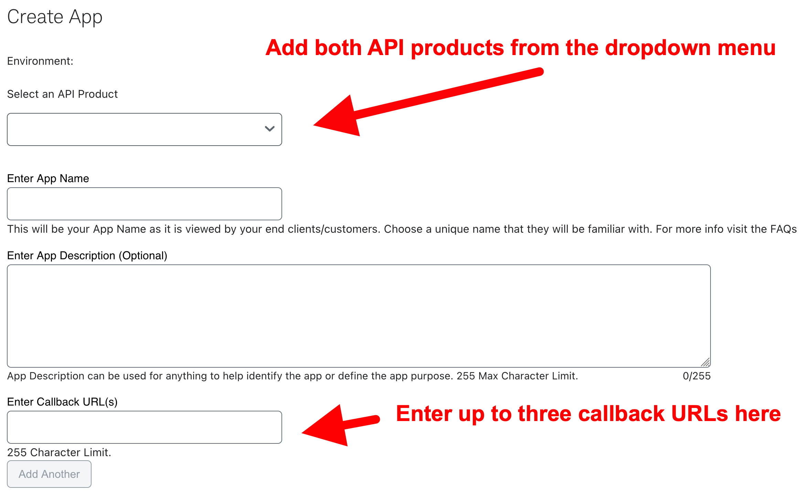
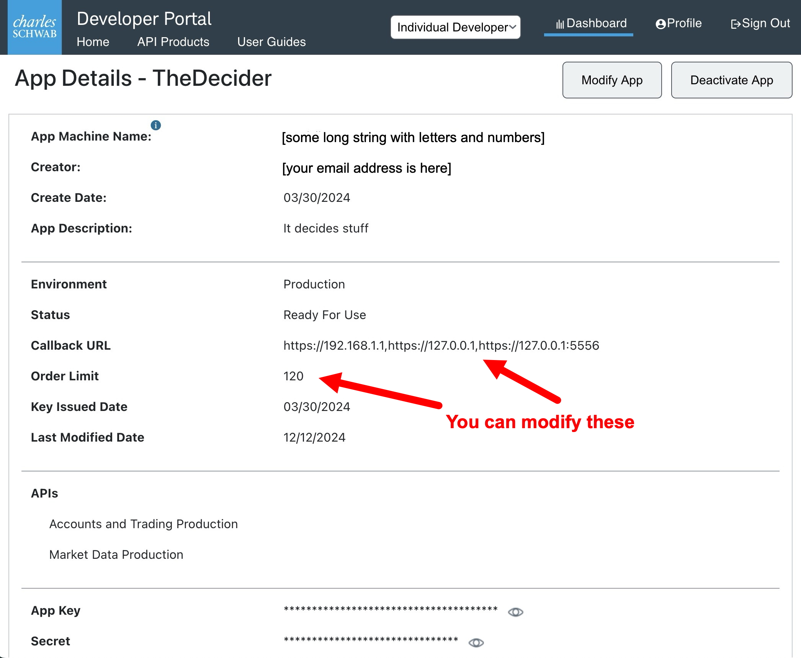
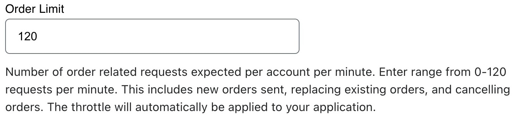
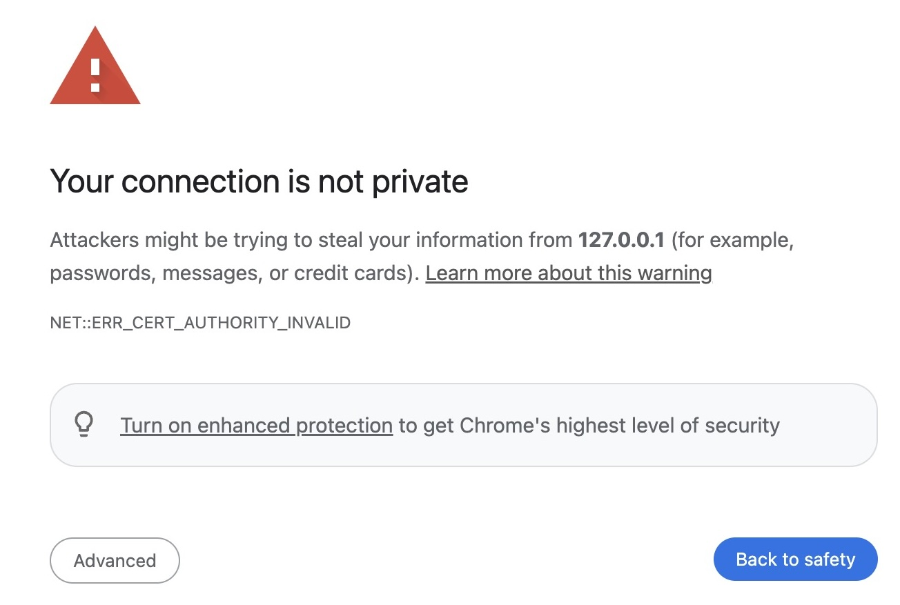
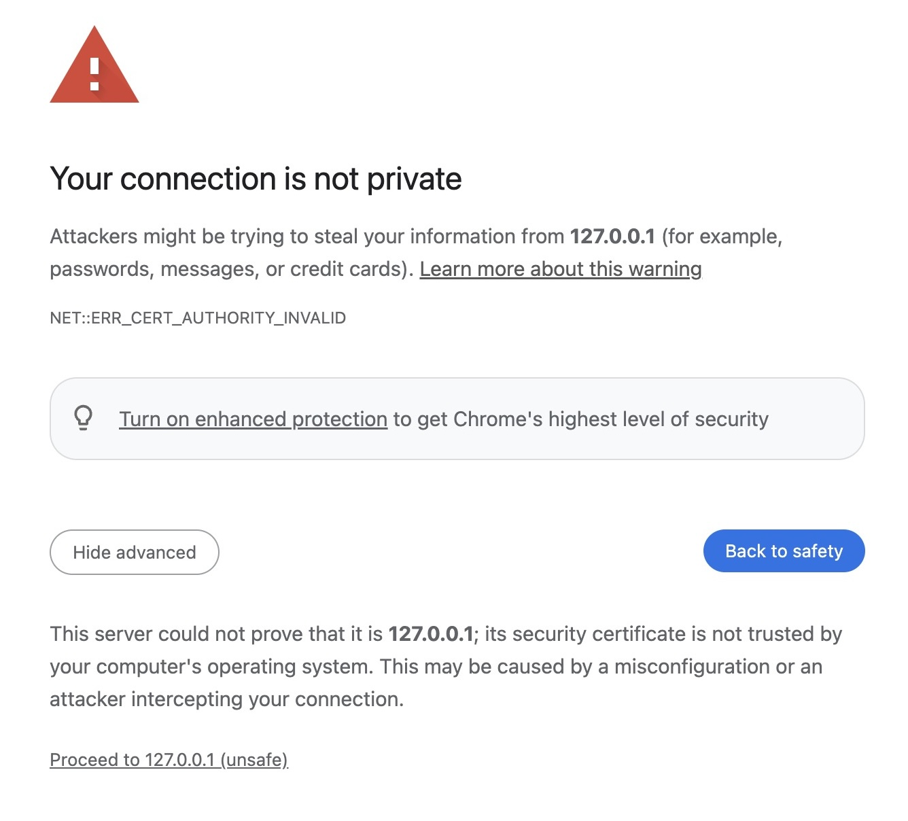
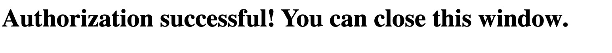
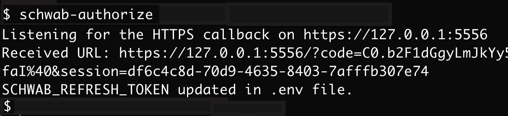
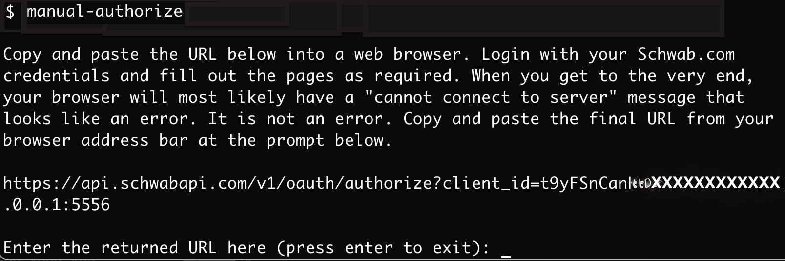

# Schwab API Configuration

## Contents
  * [Creating Your Schwab App](#creating-your-schwab-app)
    + [Figure 1: Creating a new app](#figure-1-creating-a-new-app)
    + [Adding API Products](#adding-api-products)
    + [Callback URL(s)](#callback-url-s-)
  * [Modifying Your Schwab App](#modifying-your-schwab-app)
    + [Figure 2: Modifying an existing app](#figure-2-modifying-an-existing-app)
    + [API Rate Limits](#api-rate-limits)
    + [Figure 3: Changing the rate limit for orders](#figure-3-changing-the-rate-limit-for-orders)
  * [Schwab API Refresh Token](#schwab-api-refresh-token)
     + [How The Schwab Refresh Token Is Created](#how-the-schwab-refresh-token-is-created)
     + [schwab-authorize.js and manual-authorize.js](#schwab-authorizejs-and-manual-authorizejs)
     + [Using schwab-authorize.js](#using-schwab-authorizejs)
     + [Using manual-authorize.js](#using-manual-authorizejs)

## Creating Your Schwab App
I'm assuming that you've logged into developer.schwab.com, went to your "[dashboard](https://developer.schwab.com/dashboard/apps)," and are creating an app.

### Figure 1: Creating a new app

### Adding API Products

When you create your app on developer.schwab.com, you have to make some choices that impact the use of the API (See Figure 1 above). First, you have the option of including one or both of the API "products':

- Accounts and Trading Production
- Market Data Production

I suggest adding both from the "Select an API Product" dropdown menu above. If you know that all you want is market data, you can add only `Market Data Production` but I think that's typically rare. Similarly, if you only want to make trades and look at data associated with your trades, you could just add `Accounts and Trading Production`.

### Callback URL(s)

Specifying a callback URL is required. You'll need it when you create -- or re-create -- your Schwab refresh token **which is necessary every seven days**. More on that later.

#### If you only want to add one callback URL, I recommend `https://127.0.0.1:5556` You can always change this, or add more URLs, later. But, once your app is qpproved, changing the callback URL(s) requires that your app be approved again, so you'll have to wait 1-3 days to use the API if you change them. For that reason, it's good to set your callback URLs once and not have to change it later.

The assumption here is that you're creating a web application, and that the callback URL will be the domain name of your application e.g. `https://mycoolapp.com/maybe/with/a/path`. However, I'm not aware of any developers who are using the Schwab API for a web app, but, even if they are, this still seems like a sub-optimal way of handling token authentication.

## Modifying Your Schwab App

### Figure 2: Modifying an existing app

Once you've created your app, you have to wait for it to be approved by Schwab. That usually takes 1-3 days. Once it's approved, you'll see that the **Status** is **Ready For Use**.

Note the **App Key** and **Secret** at the bottom of your app. You'll need to add these to your `.env` file as described in the [Readme](../Readme.md) file.

### API Rate Limits

You can adjust the rate limit for orders which is listed as `Order Limit` in Figure 2. You can set this to a maximum of 120 orders per minute and it's not clear why you'd want any value other than the maximum of 120. Regardless of the number you put here, the overall rate limit for the Schwab API is 120 API calls per minute. When you exceed the rate limit, calls should return the HTTP 429 response **"Rate Limit Exceeded"**

### Figure 3: Changing the rate limit for orders

## Schwab API Refresh Token

Your Schwab App Key and Secret (see Figure 2 above), which I call `SCHWAB_APP_KEY` and `SCHWAB_SECRET`, never change. However, as part of Schwab's implementation of **three-legged OAuth** (see [developer.schwab.com here](https://developer.schwab.com/user-guides/get-started/authenticate-with-oauth) and [here](https://developer.schwab.com/products/trader-api--individual/details/documentation/Retail%20Trader%20API%20Production)), there are two other tokens that change regularly. Every 30 minutes, your access token expires and has to be refreshed. This is handled for you automatically within schwab-client-js. However, your refresh token, which I call `SCHWAB_REFRESH_TOKEN` **must be refreshed every 7 days**.

## How The Schwab Refresh Token Is Created

The process to create the refresh token is a bit involved. By using either the `schwab-authorize.js` or `manual-authorize.js` scripts (see next two sections), you can circumvent all of this effort.

You first have to create a special URL:

`https://api.schwabapi.com/v1/oauth/authorize?client_id={SCHWAB_APP_KEY}&redirect_uri={SCHWAB_CALLBACK_URL}`

You then put that URL into your web browser address bar and you'll be directed to a Schwab login page where you have to login using your Schwab.com username and password (not your developer.schwab.com credentials). When you've gone through a flow of several web pages, which asks you to authorize your accounts for API access, a URL is returned in your web browser's address bar:

`https://{SCHWAB_CALLBACK_URL}/?code={AUTHORIZATION_CODE}&session={SESSION_ID}`

If your `SCHWAB_CALLBACK_URL` is `https://127.0.0.1:5556`, then you'll see a message in your browser like "Server Not Found" in your web browser.

The `AUTHORIZATION_CODE` must be used, within 30 seconds, in an API call to get the new `SCHWAB_REFRESH_TOKEN`.

# schwab-authorize.js and manual-authorize.js

As you can imagine, getting the `SCHWAB_REFRESH_TOKEN` manually would be a bit tricky and error-prone. To automate the process, I created two scripts:

- schwab-authorize.js
- manual-authorize.js

## Using schwab-authorize.js

`schwab-authorize.js` is a fully automated script. When you run it, it creates the special URL from the section above and opens it in your default web browser. You then manually login at Schwab.com and go through the flow. When you get to the end, your web browser will show a warning because the script created an unsigned SSL certificate in order to read the contents of the returned URL in order to get the `AUTHORIZATION_CODE`. `schwab-authorize.js` then makes the special API call to get the new `SCWHAB_REFRESH_TOKEN` and then adds it to your `.env` file

On MacOS and Linux, you should be able to run it from the command line when you're at the root of your project by typing `schwab-authorize` On Windows, you probably have to run the command manually like this: `C:\> node node_modules/schwab-client-js/bin/schwab-authorize.js`

### Figures 4, 5, 6, and 7 below show you the last few steps of running `schwab-authorize.js` if your default browser is Chrome on MacOS. The reason for adding a port number (in this case: 5556) to the localhost URL is so that `schwab-authorize.js` can read the URL returned by Schwab. Port numbers 0-1024 require superuser privileges to read (using no port number defaults to port 443 or 80).

<h3 style="display: inline;">Figure 4: Clicking Through The Connection Warning on MacOS Chrome*</h3>  

<h3 style="display: inline;">Figure 5: You Clicked On The "Advanced" button*</h3>  

<h3 style="display: inline;">Figure 6: You Clicked "Proceed to 127.0.0.1 (unsafe) in Figure 5 so the "Authorization successful" message appears in your web browser*</h3>  

<h3 style="display: inline;">Figure 7: What You See On The Console*</h3> 

When `schwab-authorize` finishes, it automtically edits your `.env` file and adds (or updates) the `SCHWAB_REFRESH_TOKEN`.

`schwab-authorize` is written in Javascript. You can review the source at `node_modules/schwab-client-js/bin/schwab-authorize.js`.

## Using manual-authorize.js

If clicking through the unsigned cert warning bothers you, you can use `manual-authorize.js` instead. It requires a bit more effort but it still does most of the work for you. When you use `manual-authorize.js`, you do not need to specify a port number and can just use `https://127.0.0.1` as your `SCHWAB_CALLBACK_URL` since no special privileges are needed for this method.

On MacOS and Linux, you should be able to run it from the command line when you're at the root of your project by typing `manual-authorize` On Windows, you probably have to spell everything out: `C:\> node node_modules/schwab-client-js/bin/manual-authorize.js`

<h3 style="display: inline;">Figure 8: Using manual-authorize.js*</h3> 

The app (see Figure 8) tells you everything you need to do. You have 30 seconds after the URL is returned in the web browser to cut and paste it into the prompt shown. After 30 seconds the code expires and you have to run it again.
