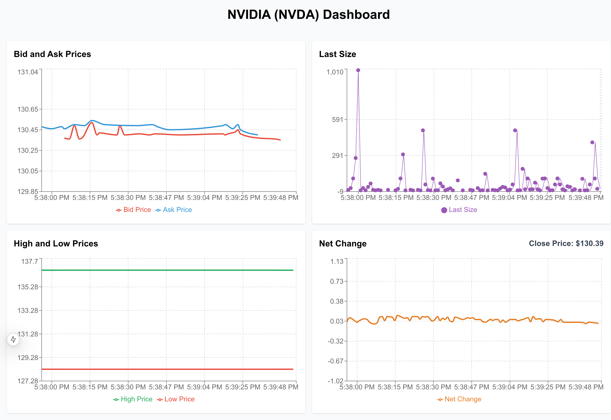

# schwab-dashboard-nextjs

## A stock market dashboard using the streaming class from schwab-client-js

<figure>
     
     <figcaption>schwab-dashboard-nextjs</figcaption>
</figure>

## This dashboard uses NextJS, Tailwind, and Recharts to stream real-time market data from Schwab and display it in your web browser

### **schwab-client-js** gives you complete access to the Schwab REST API using convenient classes and methods. You can stream real-time market data, create and track orders, and retrieve information about your account as well as retrieve different types of market data.

## Installation

**Software prerequisites: nodejs version 18 or newer and a package manager such as yarn or npm**

```
npm install

or

yarn
```

You'll need to create the `.env` file as described in the schwab-client-js instructions.
If you don't have a working SCHWAB_REFRESH_TOKEN, you can run `schwab-authorize` to create one.
See the schwab-client-js instructions.

## Usage

```
yarn dev

or

npm run dev
```

Those commands will run NextJS and then try to open the frontend in your default web browser.
The dashboard uses SSE (Server-Sent Events) to send the data from NextJS to the web browser.
You can change the stock ticker symbol by editing the file: `app/api/market-stream/route.js`

## MIT License

THE SOFTWARE IS PROVIDED "AS IS", WITHOUT WARRANTY OF ANY KIND, EXPRESS OR
IMPLIED, INCLUDING BUT NOT LIMITED TO THE WARRANTIES OF MERCHANTABILITY,
FITNESS FOR A PARTICULAR PURPOSE AND NONINFRINGEMENT. IN NO EVENT SHALL THE
AUTHORS OR COPYRIGHT HOLDERS BE LIABLE FOR ANY CLAIM, DAMAGES OR OTHER
LIABILITY, WHETHER IN AN ACTION OF CONTRACT, TORT OR OTHERWISE, ARISING FROM,
OUT OF OR IN CONNECTION WITH THE SOFTWARE OR THE USE OR OTHER DEALINGS IN THE
SOFTWARE.
